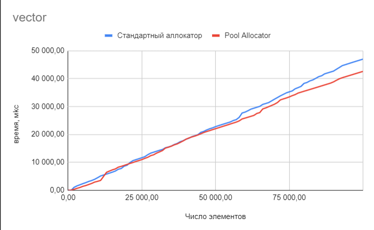
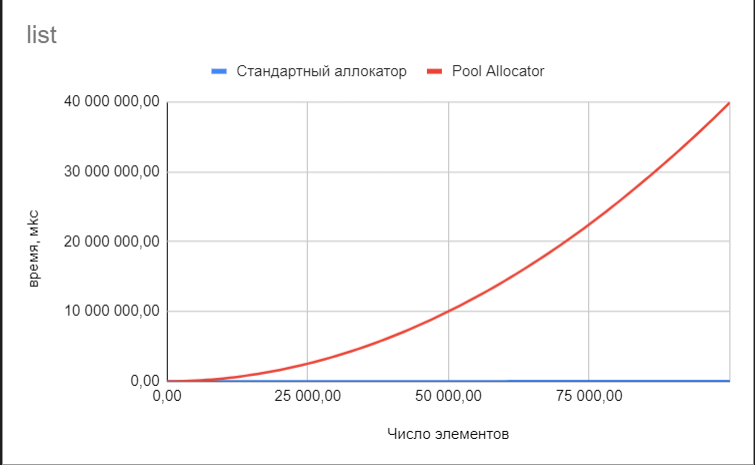
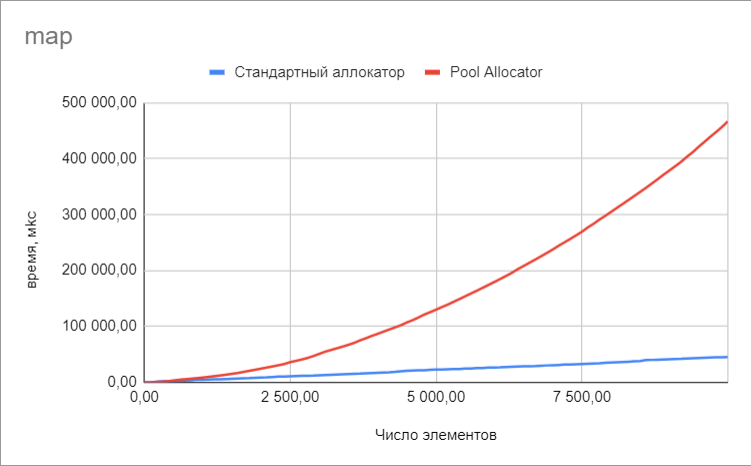

# Сравнение PoolAllocator и std::allocator
## 
Сравнение аллокаторов проходило в следующих условиях: 
для vector и list добавлялись по одному 100000
элементов, и с шагом в 1000 элементов регистрировалось прошедшее время.
Для map количество элементов было 10000, а шаг равнялся 100.
В PoolAllocator для каждого теста было создано 3 пула одинакового размера но с размерами чанков 4, 256 и 1024 байтю

### Результаты тестов vector
Время работы PoolAllocator в среднем не уступает, а при большом количестве элементов даже выигрывает у стандартного аллокатора

### Результаты тестов list

### Результаты тестов map

## Выводы
Для list и map ситуация намного хуже, время работы моего аллокатора
на несколько порядков больше, чем время встроенного аллокатора, возможно
это связано с тем, что при каждой аллокации слишком долго работает алгоритм выбора
оптимального пула для аллокации, а также, возможно, это связано с тем, что
система блоков в пулах реализована на деке, который в свою очередь работает
на стандартном аллокаторе и при большом количестве чанков маленького размера
это плохо отражается на эффективности решения.